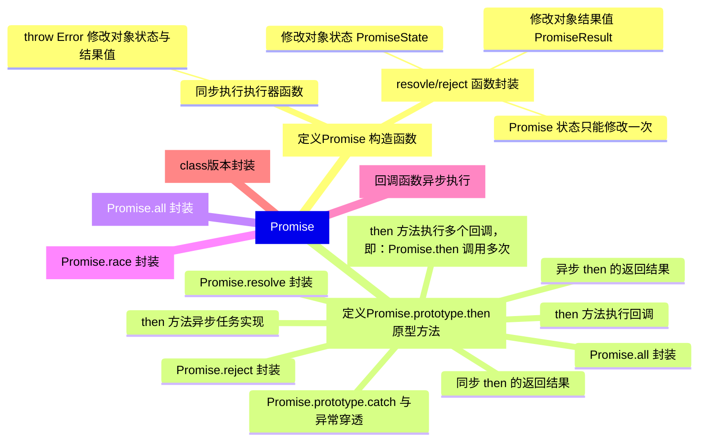

## AJAX
> 客户端与服务器端通信的跨域解决方案

### demo1
> 客户端与服务端通信实践，webserver 采用 express 框架

### demo1
> 服务启动打开 index 页面
```javascript
// 定义路由规则
app.get('/index.html', (request, response) => {
    response.sendFile(__dirname + '/index.html')
})
```

### demo2
> 手写原生 jsonp 和 jquery 发送 JSONP 案例，利用 script 标签的 src 属性，实现跨域。

## 手写 Promise 源码实践
